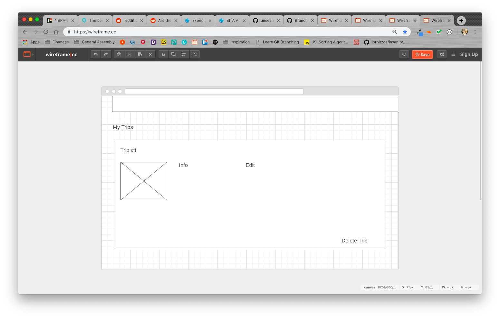

# branchforce
MEAN Stack Group Project

TRAVELERITIS is an app helping people book travel by selecting a destination / flight and dates / hotel and dates / activities all within a certain budget.

What did we use to build it

Wireframe

User Stories

Resources we used to build

Problems Encountered

What to do next

